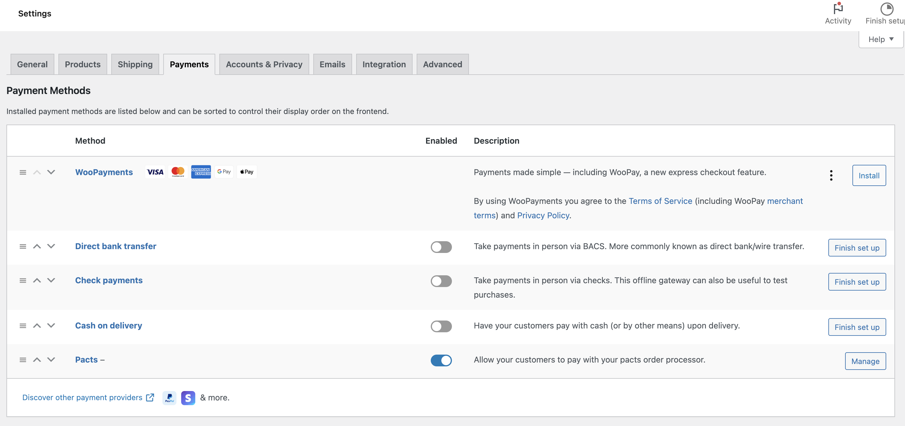
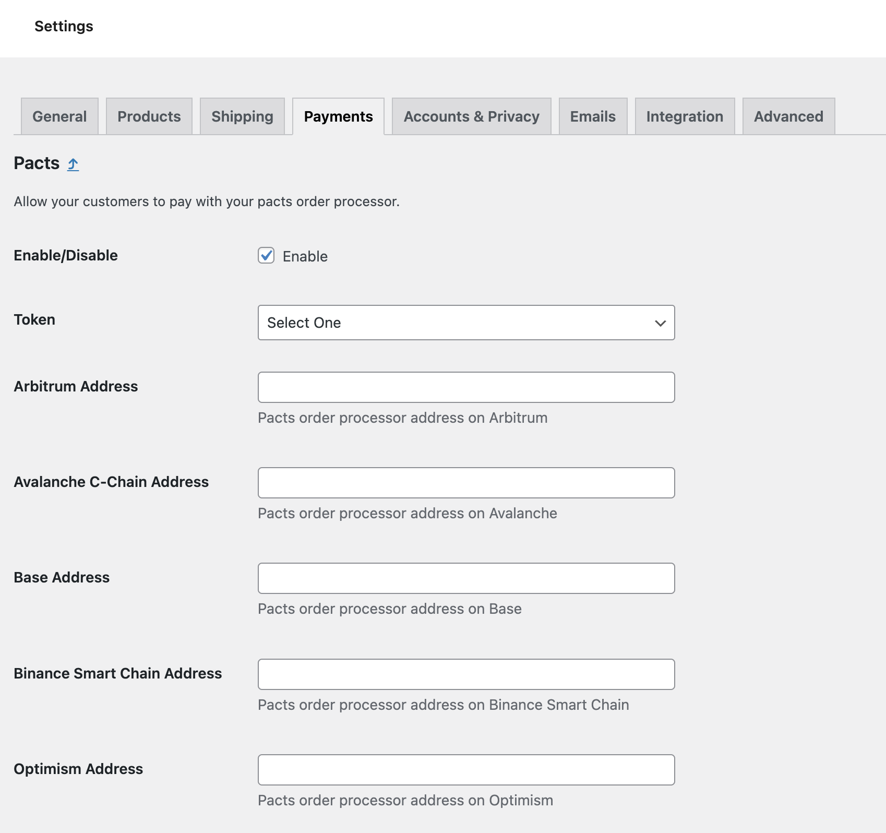

# WooCommerce Aws Example

This is a simple example of how to standup a woocommerce store on aws using [aws lightsail](https://aws.amazon.com/lightsail/).

To accept payments with Pacts, you must have an active [subscription](https://app.pacts.tech/subscribe) and at least one [deployed order processor](https://app.pacts.tech/chains).

### Setup

```sh
git clone https://github.com/PactsTech/woocommerce-aws-example.git
cd woocommerce-aws-example
npm ci
```

### Deploying

```sh
cdk deploy --all --require-approval never
```

### Wordpress

1. Navigate to [lightsail](https://lightsail.aws.amazon.com/ls/webapp/home/instances)
2. Follow instructions under **WordPress credentials**
3. Click navigate to wp-admin
4. Under `Woocommerce` > `Settings` > `Payments`
5. Enable Pacts, click manage



6. Select currency and supply contract addresses



7. Save changes

### Destroying

```sh
cdk destroy --all
```
